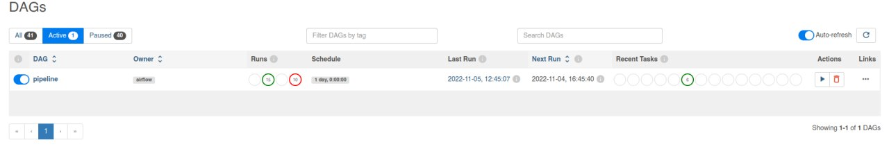

# biolab-hw4

## REQIREMENTS

1. python3
2. shell
3. [bwa](https://github.com/lh3/bwa)
4. [fastqc](https://www.bioinformatics.babraham.ac.uk/projects/fastqc/)
5. [samtools](https://github.com/samtools/samtools)
6. [airflow](https://airflow.apache.org/)
7. [freebayes](https://github.com/freebayes/freebayes)
8. browser

## INSTALLATION
I'm using manjaro linux, so the installation guide will be oriented on arch-based disrtibutions
- Airflow can be installed with [quick start page](https://airflow.apache.org/docs/apache-airflow/stable/start.html) or with [my installer](INSTALL_FRAMEWORK.sh),
beacuse it will be easier to install using virtual env :)
- bwa, fastqc, samtools and freebayes can be installed from AUR
- I have problems with freebayes, so it can be easier to download pre-built file from [release page](https://github.com/freebayes/freebayes/releases/download/v1.3.6/freebayes-1.3.6-linux-amd64-static.gz)
- Download [ref genome](https://www.ncbi.nlm.nih.gov/assembly/GCF_000005845.2/) and [sequencing result](https://www.ncbi.nlm.nih.gov/sra/?term=SRR20043616)

## RUN
1. First of all you can run pipeline with [shell script](pipeline.sh) using next command:

    ```zsh
    ./pipeline.sh <sequencung_result_without_ext> <ref_genome_without_ext>
    # For example     
    ./pipeline.sh  data/SRR20043616 data/ref
    ```
2. You can run the same pipeline using Airflow Framework and you need to follow below steps:
    
    ```zsh
    # to launch webserver
    airflow standalone
    ```
3. Go to the http://localhost:8080
4. Also in Airflow home directory copy-paste the pipeline python file to /dags
5. Then you can see something like that:

6. You can run it with button and also set the params clicking on the second button:

7. After the execution you can check the results in the page of pipeline:


# PIPELINE


# RESULTS

You can find results in /output. And also I want to mention that Airflow is very good and customizable framework.
It has a lot of great features like graph of pipline, logs, execution status, stats, source code and a lot other things.
